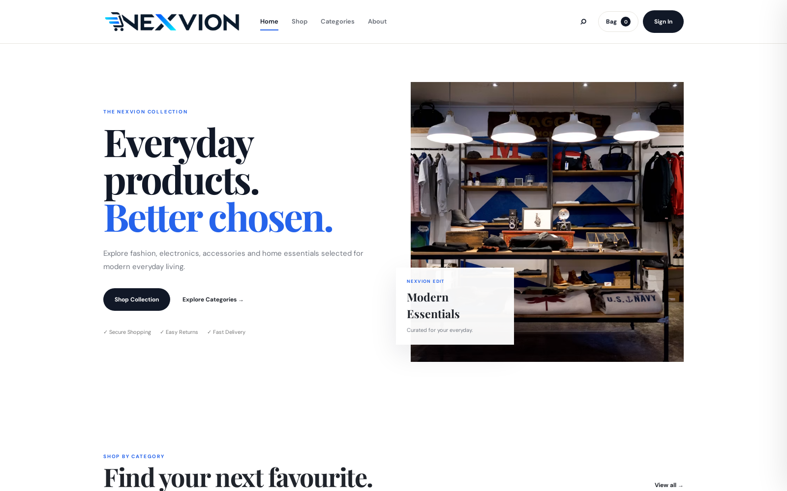
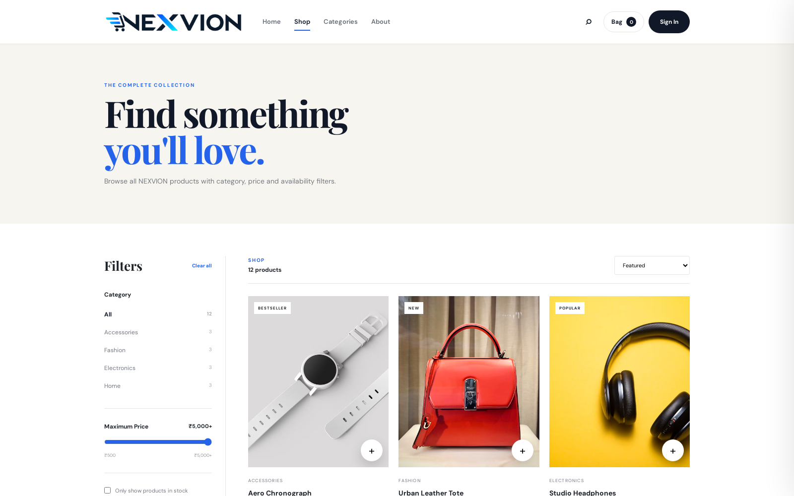
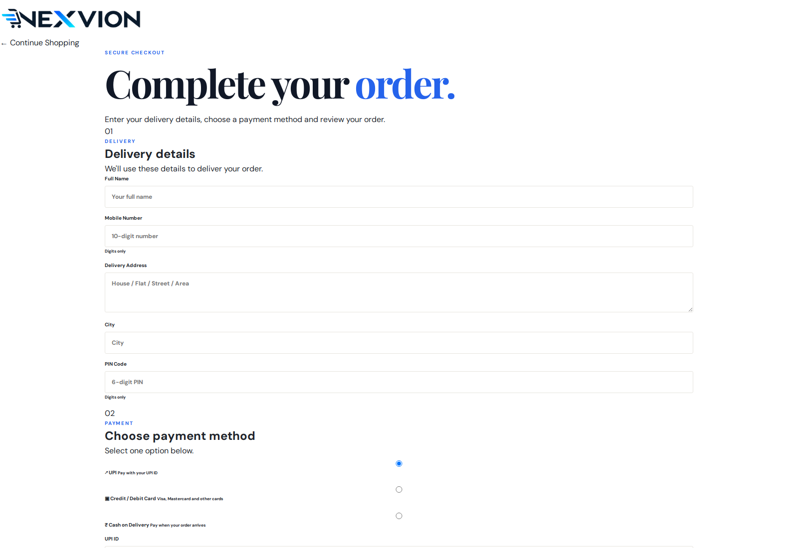
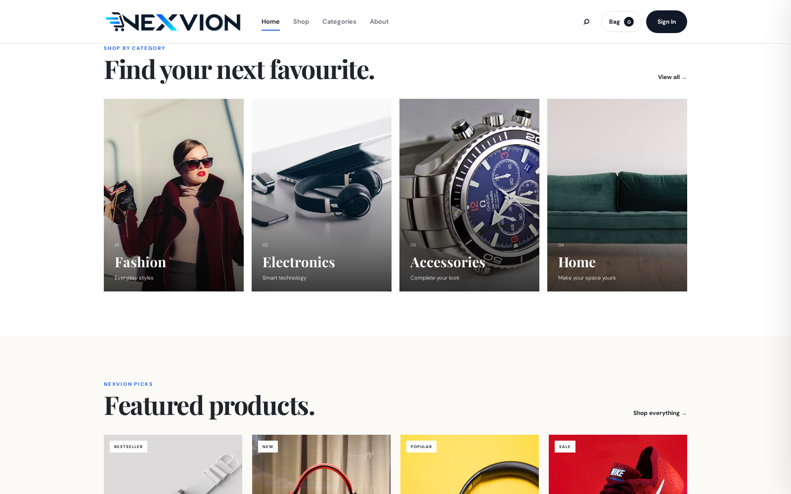
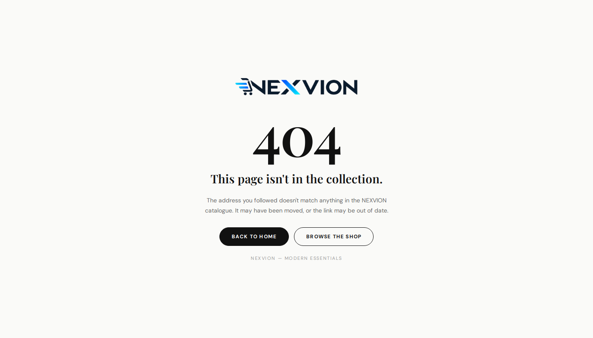

# NEXVION — screenshots

Real browser captures of the running deployment, served through the Application
Load Balancer from Fargate pods on EKS.

The homepage rendered through the ALB. The logo is served by a *different*
service (`assets`), the hero image and fonts from external CDNs — all through a
single hostname, because the load balancer routes by path.

---

The catalogue. Category filters, price range, sorting and search are driven by
`script.js` running in the browser against a 12-product in-memory catalogue.

---

The checkout page, served by the `checkout` service at `/payment.html`. Note
that this page references `style.css` and `logo.png`, which are served by the
*other* two services — the relative links resolve because all three sit behind
one hostname.

---

Category grid and featured products. These cards are rendered client-side by
`script.js` from a JSON array, with every field passed through `escapeHTML()`
before insertion.

---

The branded 404 page served by nginx inside each container, returning HTTP 404
while remaining a valid HTML document. Branded because an nginx default error
page in a storefront demo looks like a broken site.

---

All captures were made with Playwright against the ALB DNS name, at the time
recorded in `evidence/03-http-verification.md`. No image was retouched.

## What these screenshots do not show

- **HTTPS.** The ALB serves HTTP only; no ACM certificate was requested, so the
  browser shows no padlock.
- **A friendly domain.** Requests go to the AWS-assigned ALB hostname.
- **Real data.** There is no backend. Products live in a JavaScript array and the
  cart lives in `localStorage`, so reloading shows an empty bag.